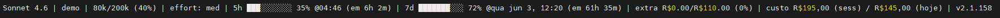

# claude-panel-money

A custom status line for [Claude Code](https://claude.com/claude-code) that displays model info, token usage, rate limits, reset times, and reset countdowns in a single compact line — and, on top of that, an **estimated spend in R$** for the current project and for today. It runs as an external shell command, so it does not slow down Claude Code or consume any extra tokens.

It builds on [daniel3303/ClaudeCodeStatusLine](https://github.com/daniel3303/ClaudeCodeStatusLine), adding the cost-estimation segment.

## Screenshot



## What it shows

| Segment | Description |
|---------|-------------|
| **Model** | Current model name (e.g., Opus 4.8) |
| **CWD@Branch** | Current folder name, git branch, and file changes (+/-) |
| **Tokens** | Used / total context window tokens (% used) |
| **Effort** | Reasoning effort level (low, med, high, xhigh) |
| **5h** | 5-hour rate limit usage percentage, progress bar, reset time, and countdown |
| **7d** | 7-day rate limit usage percentage, progress bar, reset time, and countdown |
| **Extra** | Extra usage spent / limit in R$ (if enabled) |
| **Custo** | Estimated spend in R$ — `custo R$1,23 (sess) / R$4,56 (hoje)` |
| **Update** | Appears when a new version is available (checked every 24h) |

Usage percentages are color-coded: green (<50%) → yellow (≥50%) → orange (≥70%) → red (≥90%). The cost amounts use the same intensity ladder by R$ value: green (<R$20) → yellow (≥R$20) → orange (≥R$50) → red (≥R$100).

## Cost estimation

The **Custo** segment estimates how much the recorded usage would cost, in Brazilian reais, from two angles:

- **sess** — every session of the **current project** (all `*.jsonl` transcripts under this project's folder in `~/.claude/projects/`).
- **hoje** — every project, but only records dated **today** (local time).

How it works: for each `assistant` record in the transcripts, the four token counters (`input`, `output`, `cache_creation`, `cache_read`) are multiplied by that record's model price, summed in USD, and converted to BRL by the day's exchange rate. Models without a known price are ignored.

It is split across three small, independently testable libraries that `statusline.sh` sources:

| File | Responsibility | Source | Cache |
|------|----------------|--------|-------|
| `lib_prices.sh` | Per-model token prices (the 4 rates) | [LiteLLM model prices](https://github.com/BerriAI/litellm) JSON | 24h |
| `lib_fx.sh` | USD → BRL exchange rate | [AwesomeAPI](https://docs.awesomeapi.com.br/api-de-moedas) (`economia.awesomeapi.com.br`) | 6h |
| `lib_cost.sh` | Scans the JSONL and computes both totals | the two libs above | 60s (result) |

Every fetch is bounded (`curl --connect-timeout 1 --max-time 2`), so the status line never blocks. If the network is down, each library falls back to its previous cache, and then to a built-in default — prices for Opus/Sonnet/Haiku and a default rate of R$5,40 — so a number is always shown.

## Installation

Ask Claude Code:

> Clone https://github.com/diogofelixti/claude-panel-money to `~/.claude/statusline/` (or `%USERPROFILE%\.claude\statusline\` on Windows) and configure it as my status bar by following its INSTALL.md.

Claude will clone the repo to that path, pick the right script for your OS, and update `settings.json`. Full step-by-step instructions Claude follows live in [INSTALL.md](INSTALL.md).

Restart Claude Code after Claude saves the configuration.

### Updating

```bash
git -C ~/.claude/statusline pull
```

No `settings.json` changes are needed — the path stays valid across versions.

## Requirements

- Claude Code with OAuth authentication (Pro/Max subscription for rate-limit and extra-usage data)
- `git` in `PATH`
- macOS / Linux: `jq` and `curl`
- Windows: PowerShell 5.1+ (default on Windows 10/11)

> The cost segment is implemented in the Bash (`*.sh`) libraries. On Windows (`statusline.ps1`) the rest of the status line works as before; the cost segment is not yet ported.

## Caching

All caches live under `/tmp/claude/` (or `%TEMP%\claude\` on Windows) and are shared across concurrent Claude Code instances:

| Cache | TTL |
|-------|-----|
| API usage / rate limits | 60s |
| Cost result (per project) | 60s |
| LiteLLM model prices | 24h |
| USD→BRL exchange rate | 6h |
| Release check | 24h |

## Update Notifications

The status line checks GitHub for new releases once every 24 hours via an outbound HTTP request to `api.github.com`. When a newer version is available, a second line appears below the status line. The check fails silently if the API is unreachable.

To disable the update check entirely (no network calls):

```bash
export STATUSLINE_CHECK_UPDATES=false
```

## License

MIT

## Credits

Cost-estimation fork by [diogofelixti](https://github.com/diogofelixti).

Original status line by Daniel Oliveira — [ClaudeCodeStatusLine](https://github.com/daniel3303/ClaudeCodeStatusLine).
